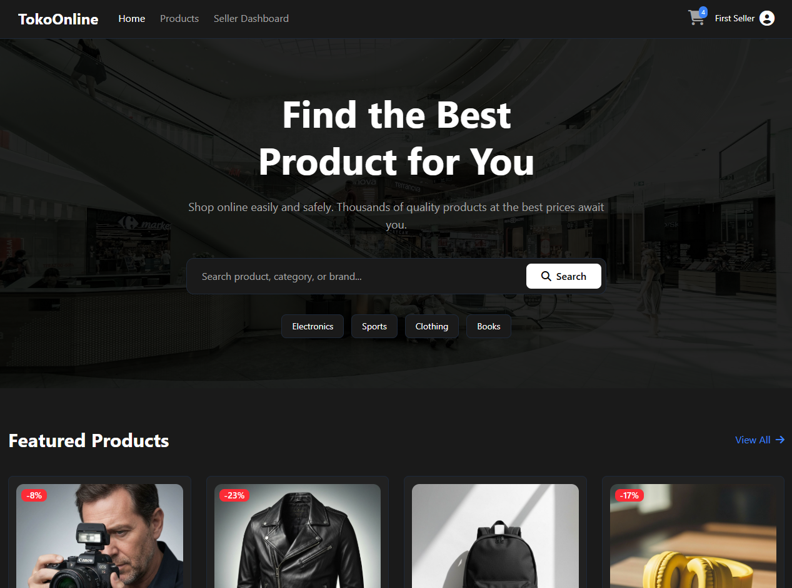
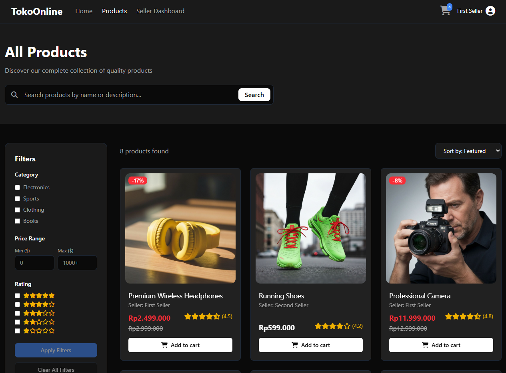
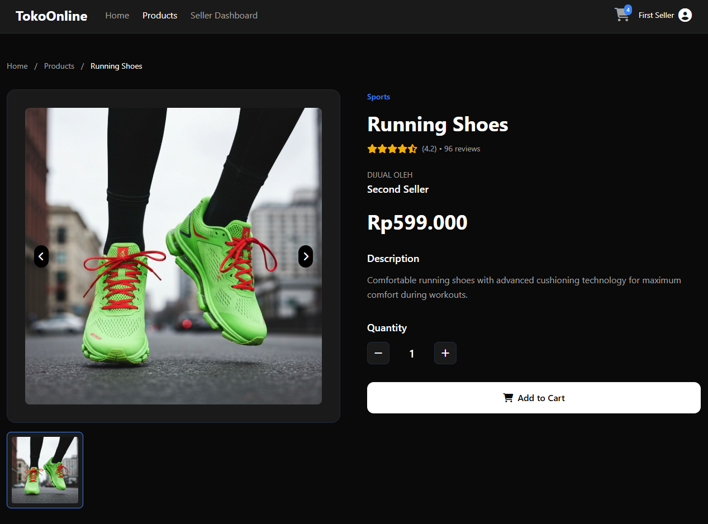
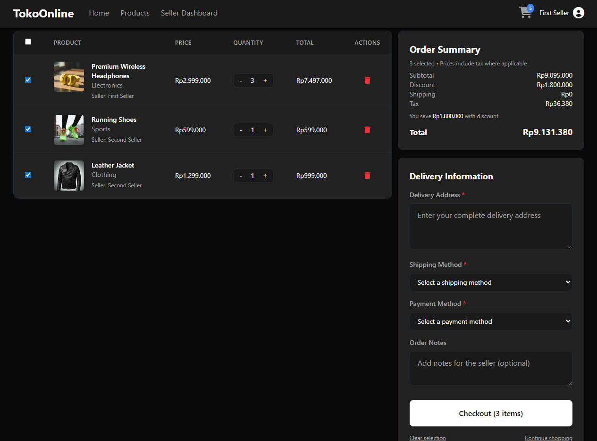
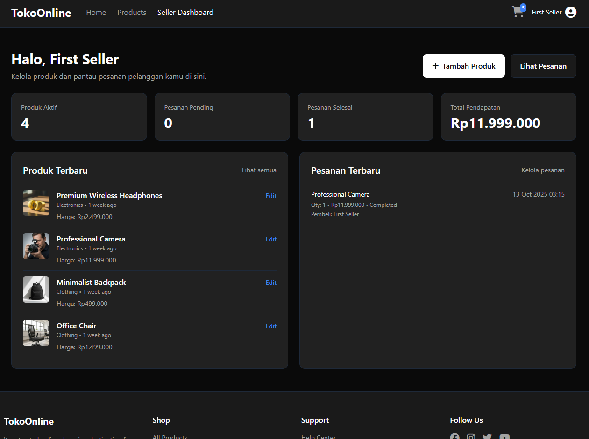
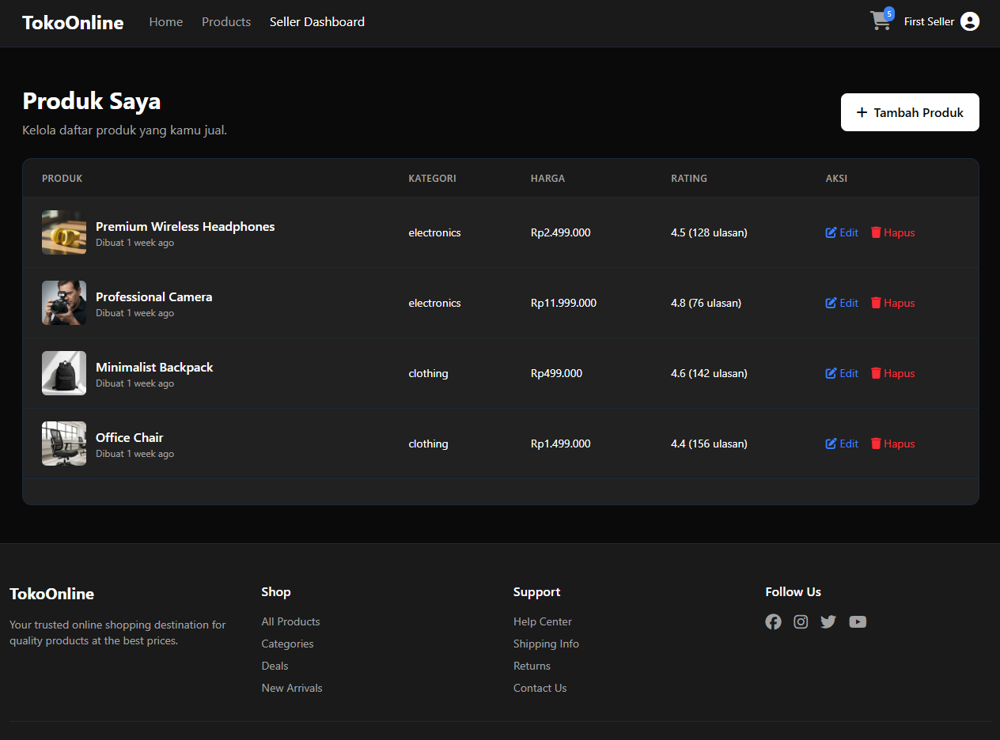

# 🛍️ TokoOnline — Simple E‑Commerce website that's barely works

TokoOnline adalah aplikasi marketplace sederhana berbasis Laravel 12 dengan tampilan modern (TailwindCSS + Vite). Proyek ini mendukung tiga peran utama:

-   Admin — kelola produk, kategori, pengguna, serta memantau keranjang pengguna.
-   Seller — kelola produk sendiri dan memproses pesanan yang masuk.
-   User — jelajah katalog, tambah ke keranjang, checkout, dan pantau pesanan.

Dengan arsitektur yang rapi dan komponen UI ringan (Alpine.js), TokoOnline cocok untuk pembelajaran maupun pondasi proyek e‑commerce skala kecil-menengah.

---

## 📸 Galeri Antarmuka

<table>
  <tr>
    <td></td>
    <td></td>
  </tr>
  <tr>
    <td></td>
    <td></td>
  </tr>
  <tr>
    <td></td>
    <td></td>
  </tr>
</table>

---

## ✨ Fitur Utama

-   👤 Autentikasi berbasis peran (Admin, Seller, User) via Laravel Breeze.
-   🛍️ Katalog produk + kategori: daftar, detail, produk terkait, rating dan harga diskon.
-   🔎 Pencarian produk cepat dari halaman utama.
-   🧺 Keranjang belanja: tambah, ubah jumlah, hapus item, dan bersihkan keranjang (AJAX endpoint + counter).
-   💳 Checkout & pesanan: input alamat, metode kirim & bayar, pembuatan pesanan per item.
-   🧑‍💼 Dashboard Seller: ringkasan metrik, kelola produk, dan update status pesanan.
-   🛠️ Panel Admin: kelola produk, kategori, pengguna, serta pantau data keranjang.
-   ⚡ Build modern dengan Vite, TailwindCSS, Alpine.js, dan Axios.

---

## 🛠️ Teknologi

-   Laravel 12, PHP ≥ 8.2
-   Laravel Breeze (Blade + Tailwind)
-   Vite, TailwindCSS, Alpine.js, Axios
-   SQLite (default), dapat diganti ke MySQL/PostgreSQL
-   Pest / PHPUnit untuk testing

---

## 🚀 Instalasi & Setup

Persyaratan: PHP ≥ 8.2, Composer, Node.js ≥ 18, npm

```bash
# 1) Install dependensi PHP
composer install

# 2) Salin env & generate app key
cp .env.example .env
php artisan key:generate

# 3) Siapkan database SQLite (opsi default)
touch database/database.sqlite

# 4) Migrasi & seeding data awal
php artisan migrate
php artisan db:seed

# (Opsional tapi direkomendasikan) Link penyimpanan publik untuk upload gambar
php artisan storage:link

# 5) Install dependensi frontend
npm install

# 6) Jalankan aplikasi (pilih salah satu)
# Opsi A: semua sekaligus (server + queue + Vite)
composer dev

# Opsi B: jalankan terpisah
php artisan serve
npm run dev
```

Catatan:

-   Konfigurasi lingkungan ada di `.env` (lihat contoh di `.env.example`).
-   Secara default, `DB_CONNECTION=sqlite`. Untuk database lain, sesuaikan kredensial dan jalankan ulang migrasi.
-   Jika menggunakan `SESSION_DRIVER=database`, pastikan tabel `sessions` tersedia (jalankan `php artisan session:table` lalu `php artisan migrate` bila diperlukan).
-   Untuk fitur upload gambar (Seller), jalankan `php artisan storage:link` agar file tersaji melalui `/storage`.
-   Jika menggunakan `SESSION_DRIVER=database`, pastikan tabel `sessions` tersedia (jalankan `php artisan session:table` lalu `php artisan migrate` bila diperlukan).

---

## 🔑 Kredensial Default (Seeder)

| Peran  | Email                     | Password   |
| ------ | ------------------------- | ---------- |
| Admin  | `admin@tokoonline.test`   | `password` |
| Seller | `seller1@tokoonline.test` | `password` |
| Seller | `seller2@tokoonline.test` | `password` |
| User   | `test@example.com`        | `password` |

Login sebagai Admin/Seller untuk mengakses dashboard masing‑masing. Akun User dapat berbelanja dan checkout.

---


## 🧪 Testing

Jalankan seluruh test:

```bash
php artisan test
```

---

## 🤝 Kontribusi

Saran fitur, perbaikan bug, atau peningkatan UI/UX sangat dipersilakan. Silakan buat issue atau pull request.

---

Selamat menggunakan TokoOnline! 🚀
